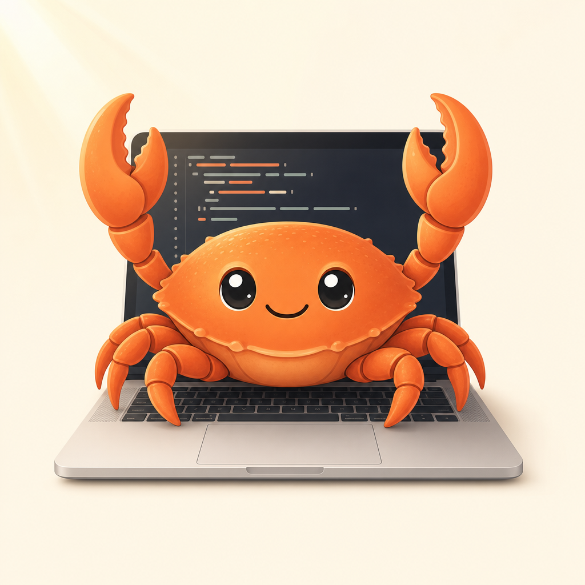

# Nolty

### Claude Running Like OpenClaw — always-on AI agents on your standard Claude plan

<p align="center">
  
</p>

**Cron-driven AI agents on your standard Claude plan. No Agent SDK credits required.**

Nolty is a migration toolkit for OpenClaw users moving to Claude Code, and a complete always-on agent stack for anyone who wants OC-style ergonomics on top of Claude Code: an always-on Claude session that listens to Telegram, runs scheduled crons every 15 minutes, dispatches work to Task sub-agents (so the main thread stays responsive to chat), and self-heals when Claude Code auto-upgrades.

---

## Why this exists

If you used OpenClaw, you got used to:

- An always-on agent you could ping from Telegram anywhere
- Scheduled background jobs (morning brief, daily recap, weekly rollups)
- The agent owning its own memory and knowing your week
- Web-driven crons (LinkedIn analytics, sheet updates) via a real signed-in browser

Claude Code can do all of this — but you have to wire it. Out of the box you get the CLI, sub-agents, MCP plugins, claude-in-chrome, and slash commands. What's missing is the always-on session, the cron dispatcher, the dispatch routing rules, and the recovery patterns when things drift.

Nolty packages all of that.

---

## Key headline: no Agent SDK credits

Anthropic's June 15, 2026 policy change separates Claude Agent SDK usage (`claude -p` / non-interactive) from interactive Claude Code. SDK usage now draws from a separate monthly credit pool; interactive Claude Code stays on your standard plan.

**Nolty's architecture is 100% interactive Claude Code.** The cron-runner is a Python script that types slash commands into a live tmux session via `tmux send-keys` — it never calls `claude -p`. Sub-agents run inside the interactive session. The Telegram plugin runs inside the interactive session.

Anyone running an OpenClaw-style headless cron setup will start drawing from the Agent SDK credit pool after June 15. Anyone running Nolty won't.

---

## What you get

Seven reusable patterns, each independently valuable:

1. **`cron-runner/`** — Python LaunchAgent that wakes every 15 min, reads `cron-jobs.json`, and types due slash commands into Nolty's tmux session. Replaces runCLAUDErun. No menu-bar GUI, JSON config, programmable.

2. **TelegramConfig subfolder pattern** — Plugin scope is workspace-root only. Putting the Telegram-enabled settings in a subfolder lets you open the parent in an IDE without spawning a duplicate listener.

3. **Cron-suffix dispatch routing** — `CLAUDE.md` teaches the agent that when a slash command arrives with `[cron model:X effort:Y]`, it spawns a Task sub-agent (with that model + effort) rather than running in the main thread. Sub-agents inherit `claude-in-chrome` MCP — Chrome-driven crons just work.

4. **`cron-management` skill** — Natural-language CRUD: "show crons", "disable heartbeat", "run audible deals now", "add a cron that pulls the weather at 8am". Live management without editing JSON by hand.

5. **Absolute-path discipline** — Sub-agents get a thin PATH. Skills use `/opt/homebrew/bin/gog` (absolute) instead of `gog`. This single rule prevents the most common silent-failure mode.

6. **`/nolty-restart` recovery skill** — Global slash command that diagnoses and restarts the whole stack from any Claude Code session. When Telegram goes silent or crons stop firing, you run this from any terminal and it figures out what's broken and fixes it.

7. **Heartbeat self-heal** — The every-30-min heartbeat skill (`STEP 0.5`) checks for Claude Code version drift and auto-restarts the tmux session before you notice. Catches the most common "everything went silent after CC auto-upgrade" failure.

---

## Quick start

```bash
# 1. Clone
git clone https://github.com/bradbushSFAI/nolty.git ~/Documents/CodingProjects/nolty
cd ~/Documents/CodingProjects/nolty

# 2. Install deps
brew install tmux python   # if not already installed
pip3 install croniter

# 3. Set up Telegram bot (see docs/SETUP_TELEGRAM.md)
#    - Create bot with @BotFather
#    - Get your chat_id from @userinfobot
#    - Save token + chat_id to ~/.claude/channels/telegram/.env (or ask Claude to do it)

# 4. Copy templates to live files (or ask Claude to integrate your OpenClaw
#    or other agent files into these files as they are copied over)
cp USER.template.md USER.md
cp MEMORY.template.md MEMORY.md
cp IDENTITY.template.md IDENTITY.md
cp SOUL.template.md SOUL.md
cp TOOLS.template.md TOOLS.md
cp HEARTBEAT.template.md HEARTBEAT.md
cp AGENTS.template.md AGENTS.md
cp cron-runner/cron-jobs.example.json cron-runner/cron-jobs.json

# 5. Edit USER.md, MEMORY.md, cron-jobs.json with your specifics (or ask
#    Claude to help — paste your context, let her fill in the placeholders)

# 6. Install the LaunchAgent (one-shot install script)
./scripts/install.sh

# 7. Start Nolty's tmux session
./clawd-restart.sh

# 8. Verify everything
./scripts/preflight-check.sh
```

You should now be able to message your Telegram bot and get a reply. Within 30 minutes the first heartbeat fires.

For the full setup walkthrough including BotFather, LaunchAgent persistence, and claude-in-chrome configuration, see [`docs/SETUP_TELEGRAM.md`](docs/SETUP_TELEGRAM.md) and [`docs/SETUP_LAUNCHAGENT.md`](docs/SETUP_LAUNCHAGENT.md).

---

## Repository layout

```
nolty/
├── README.md                  # this file
├── LICENSE                    # MIT
├── CLAUDE.md                  # Nolty's operating rules (loaded every session)
├── *.template.md              # foundation file templates (copy → *.md)
├── clawd-restart.sh           # restart Nolty's tmux session
├── assets/
│   ├── nolty.png              # Nolty the orange crab mascot
│   └── sfai-logo.png
├── TelegramConfig/            # subfolder with Telegram plugin enabled
│   ├── CLAUDE.md
│   └── .claude/settings.json
├── cron-runner/
│   ├── bin/
│   │   ├── cron-runner.py     # the dispatcher
│   │   └── send-telegram.sh   # emergency fallback only
│   ├── cron-jobs.example.json # sample jobs
│   ├── requirements.txt       # croniter
│   ├── com.example.cron-runner.plist.template
│   ├── state/                 # gitignored runtime state
│   └── logs/                  # gitignored runtime logs
├── skills/                    # core skills (cron-management, heartbeat, nolty-mood, chatgpt-image)
├── examples/                  # 14 example skill patterns (Brad's originals, genericized)
├── .claude/
│   ├── settings.json          # plugin DISABLED at parent scope
│   └── commands/
│       └── nolty-restart.md   # /nolty-restart global recovery command
├── memory/                    # gitignored daily session logs
├── tests/
│   └── test_cron_runner.py    # pytest tests
├── scripts/
│   ├── install.sh
│   ├── preflight-check.sh
│   └── scrub.sh
└── docs/
    ├── MIGRATION_FROM_OPENCLAW.md
    ├── SETUP_TELEGRAM.md
    ├── SETUP_LAUNCHAGENT.md
    ├── SETUP_GOG.md
    ├── SETUP_CLAUDE_IN_CHROME.md
    ├── RECOVERY.md
    ├── SKILL_REFERENCE.md
    ├── CUSTOMIZING_NOLTY.md
    ├── TESTING.md
    ├── PORTING.md
    ├── architecture.md
    └── cron-runner-internals.md
```

---

## Requirements

**Required (the baseline):**

- **macOS** (Linux port possible — see `docs/PORTING.md` — Windows requires WSL2)
- **Python 3.9+**
- **`croniter`** (`pip install croniter`)
- **tmux** (`brew install tmux`)
- **Telegram bot** (free; create with [@BotFather](https://t.me/botfather))
- **`telegram@claude-plugins-official`** plugin (installs via `claude` CLI)
- **`gog`** CLI (Gmail/Calendar/Sheets/Drive) — see [`docs/SETUP_GOG.md`](docs/SETUP_GOG.md)

**Optional (per skill):**

- **claude-in-chrome configured** — required only for skills that drive the browser (LinkedIn examples). Free; install the Chrome extension, sign into your accounts.
- **OpenAI API key** — required only for image-generation skills (`chatgpt-image`, used by `nolty-mood`). See [`docs/SETUP_OPENAI.md`](docs/SETUP_OPENAI.md).
- **qmd** — local markdown vector search; only the `qmd-reindex` example needs it
- **`audible-deals`** Python package — only the `audible-deals` example needs it
- **Perplexity MCP** — only the `home-loan-rate` example needs it

**Not a dependency:** `claude-in-chrome` is built into Claude Code, not a separate install. OpenClaw is not a dependency (this toolkit replaces it).

---

## What about Linux / Windows?

macOS is the only OS supported in v1. The macOS-specific bits are:

- `launchctl` + LaunchAgent plist (replace with systemd user units on Linux)
- `~/Library/LaunchAgents/` boot persistence (replace with `systemctl --user enable`)
- A few `lsof` / `pgrep` calls (work on Linux; need WSL on Windows)

A Linux port is ~1 day of work for a contributor. See [`docs/PORTING.md`](docs/PORTING.md) for the substitution table.

---

## Documentation

- **[Migration from OpenClaw](docs/MIGRATION_FROM_OPENCLAW.md)** — if you have an OC install today, here's the mapping
- **[Architecture](docs/architecture.md)** — how cron-runner, tmux, and the dispatch routing fit together
- **[Cron-runner internals](docs/cron-runner-internals.md)** — `cron-jobs.json` schema, scheduling logic, failure modes
- **[Setup: Telegram](docs/SETUP_TELEGRAM.md)** — BotFather walkthrough, plugin install, getting your chat_id
- **[Setup: LaunchAgent](docs/SETUP_LAUNCHAGENT.md)** — install the cron-runner plist with boot persistence
- **[Setup: gog](docs/SETUP_GOG.md)** — install + auth the Gmail/Calendar/Sheets CLI
- **[Setup: claude-in-chrome](docs/SETUP_CLAUDE_IN_CHROME.md)** — configure the Chrome extension for web-driven crons
- **[Setup: OpenAI API key](docs/SETUP_OPENAI.md)** — for image-generation skills (`chatgpt-image`, `nolty-mood`)
- **[Recovery](docs/RECOVERY.md)** — the `/nolty-restart` playbook + manual recovery
- **[Skill reference](docs/SKILL_REFERENCE.md)** — what each shipped skill does, what it depends on
- **[Customizing Nolty](docs/CUSTOMIZING_NOLTY.md)** — swap the persona, change the brand
- **[Testing](docs/TESTING.md)** — pytest, preflight-check, fresh-user simulation
- **[Porting](docs/PORTING.md)** — Linux + Windows substitution notes

---

## Status

Pre-release. Public v0.1.0. Tested on macOS 24.6.0 (Darwin), Python 3.11, tmux 3.4. Battle-tested in a single-user setup since May 2026.

---

## Contributing

Issues and PRs welcome. Focus areas:

- **Linux port** — systemd user unit equivalent of the LaunchAgent
- **Alt channels** — iMessage, Discord, Slack plugin support
- **More example skills** — yours might help someone else

See `CONTRIBUTING.md` for the standard PR workflow.

---

## License

MIT — see [LICENSE](LICENSE). Copyright 2026 Brad Bush and Strategy For AI.

---

<br/>

## Built by Strategy For AI

<p align="left">
  
</p>

**[Strategy For AI](https://www.strategyfor.ai)** helps professional services firms — CPAs, lawyers, engineers, consultants, PE/investment banking, and architecture firms — adopt AI in ways that actually move the business. We focus on friction removal: identifying the workflows that drain hours each week, designing AI tooling that fits how your team actually works, and shipping it in weeks not quarters.

We built Nolty because we needed an always-on agent that handled our own scheduling, content, and operations — and we wanted to share what worked.

**If your firm wants to put AI to work in the same disciplined way, [strategyfor.ai](https://www.strategyfor.ai) is where to start.**
